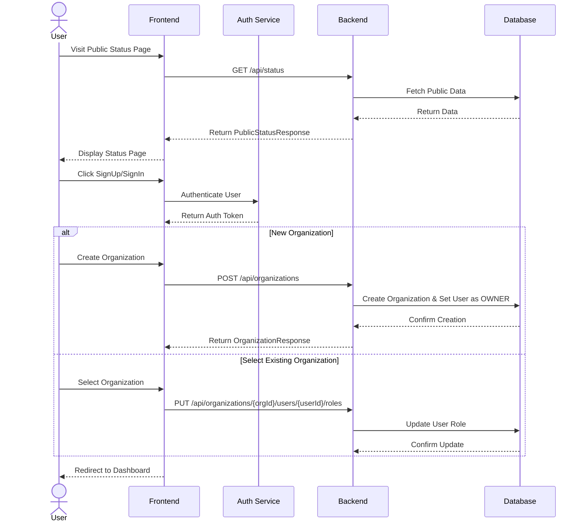
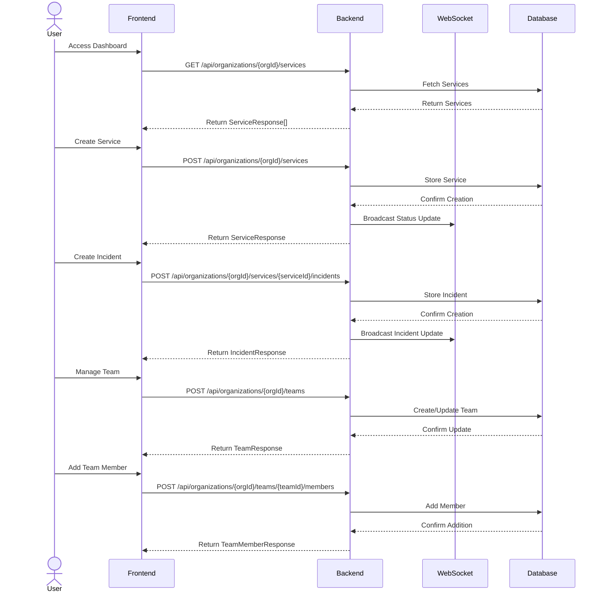
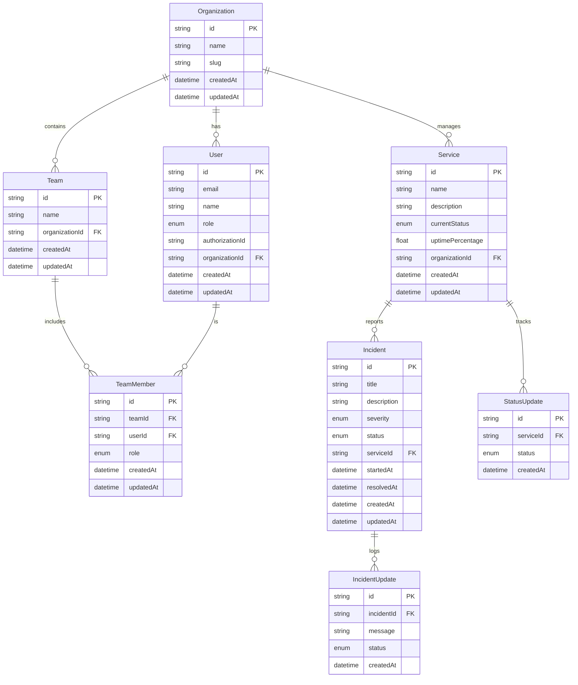

# pulse-watch-plivo-hiring-assignment

Pulse Watch is a Status Page Application allowing users to maintain and manage services, incidents, schedule maintenance. Proving users with real-time updates and it includes both an administrative interface for managing services and a public-facing status page for end users

### Index

- [Features](#features)
- [Tasks](#tasks)
- [Tech Stack](#tech-stack)
- [Architecture Diagrams](#arch-diagrams)
  - [Authentication Flow](#auth-flow)
  - [Service and Incident Management Flow](#service-and-incident-flow)
  - [Database ER (entity-relationship) Diagram](#db-er)
- [APIs in Backend](#api-request-response)
- [URLs in UI](#urls)

## Features <a id="features"></a>

- User Authentication and Team Management
- Multi-tenant Organization Support
- Service Status Management
- Incident and Maintenance Tracking
- Real-time Updates via WebSocket
- Public Status Page
- Modern UI with ShadcnUI

## Tasks <a id="tasks"></a>

- Frontend
  - Public Status Page
    - [x] List Services , Active and Past Incidents of All Organizations
    - [x] Filter based on Organization
    - [x] SignIn and SignUp Buttons
    - [x] My Dashboard button for Logged In User
  - Dashboard
    - [x] Show statistics for Active Incidents, Services and Team Members
    - [x] Show Recent Services
  - Services
    - [x] View Services
    - [x] Update Service
    - [x] Create New Service
  - Incidents
    - [x] View Incidents
      - Lists "Active", "Resolved" and "All" incidents with service names
    - [x] Report Incident
    - [x] Report Incident under Specific Service
    - [x] Update Incident
    - [x] User can filter based on Services
  - Team / Team Members
    - [x] View Team Members
    - [x] Create Team
    - [ ] Edit Team
    - [x] Edit Team or Change Role for Team Member
    - [x] Add "Freelancer User" as Team Member
  - [x] SignIn/SignUp Page
  - [x] Create your Organization as part of SignUp
  - [ ] Common Error Page
  - [ ] Websocket connection between backend and frontend
- Backend
  - [x] Create Schema Design for DB
  - [x] Create Relations in PostgreSQL DB
  - [ ] Multi-Tenant Creation
  - [x] APIs for Organizations
  - [x] APIs for Services
  - [x] APIs for Incidents
  - [x] APIs for Teams
  - [x] APIs for Team Members
  - [x] APIs for Users
  - [x] API for Websocket connection for live updates
- [ ] Authentication with Clerk
- [ ] Integrate Frontend with Backend
- [x] Write Docker Compose file for Backend
- Testing
  - [ ] Add e2e test with Playwright
  - [ ] Add unit tests as required
- Deployment
  - [ ] Docker Compose
  - [ ] Deploy on Vercel or Heroku
  - [ ] GHA Setup for Auto-Updates
- General Code Practices
  - [ ] Follow Clean Code Architecture Principes
  - [ ] Iteration for Error Validations
  - [ ] Iteration to Clean frontend code to create more reusable components
- Future TODOs
  - [ ] Implement Email Notifications
  - [ ] Implement Email Invitations for Users

## Tech Stack <a id="tech-stack"></a>

- Frontend
  - `React 18`: Frontend framework
  - `TypeScript`: Static typing and enhanced developer experience
  - `Vite`: Build tool and development server
  - `TailwindCSS`: Utility-first CSS framework
  - `ShadcnUI`: Component library for consistent design
  - `React Router DOM`: Client-side routing
  - `React Hook Form`: Form handling and validation
  - `Lucide React`: Icon library
- Backend
  - `Express.js`: Node.js web application framework for building RESTful APIs
  - `Prisma`: Modern database ORM and toolkit for type-safe database operations
  - `TypeScript`: Programming language adding static types to JavaScript
  - `Node.js`: JavaScript runtime environment for server-side execution
  - `ESLint`: Code quality tool for identifying and fixing problems
  - `ts-node`: TypeScript execution engine and REPL for Node.js
  - `@prisma/client`: Auto-generated database client for type-safe queries
  - `Express Types`: TypeScript definitions for Express.js framework

## Architecture Diagrams <a id="arch-diagrams"></a>

### Authentication Flow <a id="auth-flow"></a>



### Service and Incident Management Flow <a id="service-incident-flow"></a>



### Database ER (entity-relationship) Diagram <a id="db-er"></a>



## API in Backend <a id="api-request-response"></a>

```

1. Organization Endpoints <a id="org-endpoints"></a>

- GET /api/organizations (Accessible: All authenticated users)
- GET BY ORG ID /api/organizations/{orgId} (OWNER, ADMIN)
- POST /api/organizations (Accessible: Any authenticated user)
- PUT /api/organizations/{orgId} (OWNER, ADMIN)
- DELETE /api/organizations/{orgId} (OWNER only)


2. Team Endpoints <a id="team-end"></a>

- GET /api/organizations/{orgId}/teams (OWNER, ADMIN, TEAM_ADMIN)
- GET BY TEAM ID /api/organizations/{orgId}/teams/{teamId} (OWNER, ADMIN, TEAM_ADMIN, TEAM_MEMBER)
- POST /api/organizations/{orgId}/teams (OWNER, ADMIN)
- PUT /api/organizations/{orgId}/teams/{teamId} (OWNER, ADMIN, TEAM_ADMIN)
- DELETE /api/organizations/{orgId}/teams/{teamId} (OWNER, ADMIN)

3. Team Member Endpoints <a id="team-member-end"></a>

- GET /api/organizations/{orgId}/teams/{teamId}/members (OWNER, ADMIN, TEAM_ADMIN, TEAM_MEMBER)
- POST /api/organizations/{orgId}/teams/{teamId}/members (OWNER, ADMIN, TEAM_ADMIN)
- PUT /api/organizations/{orgId}/teams/{teamId}/members/{userId} (OWNER, ADMIN, TEAM_ADMIN)
- DELETE /api/organizations/{orgId}/teams/{teamId}/members/{userId} (OWNER, ADMIN, TEAM_ADMIN)

4. Service Endpoints <a id="service-end"></a>

- GET /api/organizations/{orgId}/services (All roles)
- GET BY SERVICE ID /api/organizations/{orgId}/services/{serviceId} (OWNER, ADMIN, SERVICE_MANAGER)
- POST /api/organizations/{orgId}/services (OWNER, ADMIN, SERVICE_MANAGER)
- PUT /api/organizations/{orgId}/services/{serviceId} (OWNER, ADMIN, SERVICE_MANAGER, STATUS_REPORTER)
- DELETE /api/organizations/{orgId}/services/{serviceId} (OWNER, ADMIN)

5. Incident Endpoints <a id="incident-end"></a>

- GET /api/organizations/{orgId}/services/{serviceId}/incidents (All roles)
- GET BY INCIDENT ID /api/organizations/{orgId}/services/{serviceId}/incidents/{incidentId} (All roles
- POST /api/organizations/{orgId}/services/{serviceId}/incidents (OWNER, ADMIN, SERVICE_MANAGER, STATUS_REPORTER)
- PUT /api/organizations/{orgId}/services/{serviceId}/incidents/{incidentId} (OWNER, ADMIN, SERVICE_MANAGER, STATUS_REPORTER)
- DELETE /api/organizations/{orgId}/services/{serviceId}/incidents/{incidentId} (OWNER, ADMIN, SERVICE_MANAGER)

6. Public Status Page Response

- GET /api/status

7. Users

- GET /api/organizations/{orgId}/users (OWNER, ADMIN)
- POST /api/organizations/{orgId}/users/invite (OWNER, ADMIN)
- PUT /api/organizations/{orgId}/users/{userId}/roles (OWNER, ADMIN)

```

## URLs in UI <a id="urls"></a>

```

SignUp = "signup",

// Public routes
PublicStatus = "/",

// Root
Dashboard = "/dashboard",

// Team routes
AddTeamMembers = "/teams/add-members",
CreateTeam = "/teams/create",
ViewTeamMembers = "/teams/view-members",
EditTeamMeber = "/teams/edit-member/:teamId/:userId",

// Service routes
CreateService = "/services/create",
ServiceManagement = "/services/manage",
UpdateService = "/services/update/:serviceId",

// Incident routes
IncidentManagement = "/incidents/manage",
UpdateIncident = "/incidents/manage/:serviceId/:incidentId",
ReportServiceSpecificIncident = "/incidents/manage/:serviceId/new",
ReportIncident = "/incidents/report",

```
