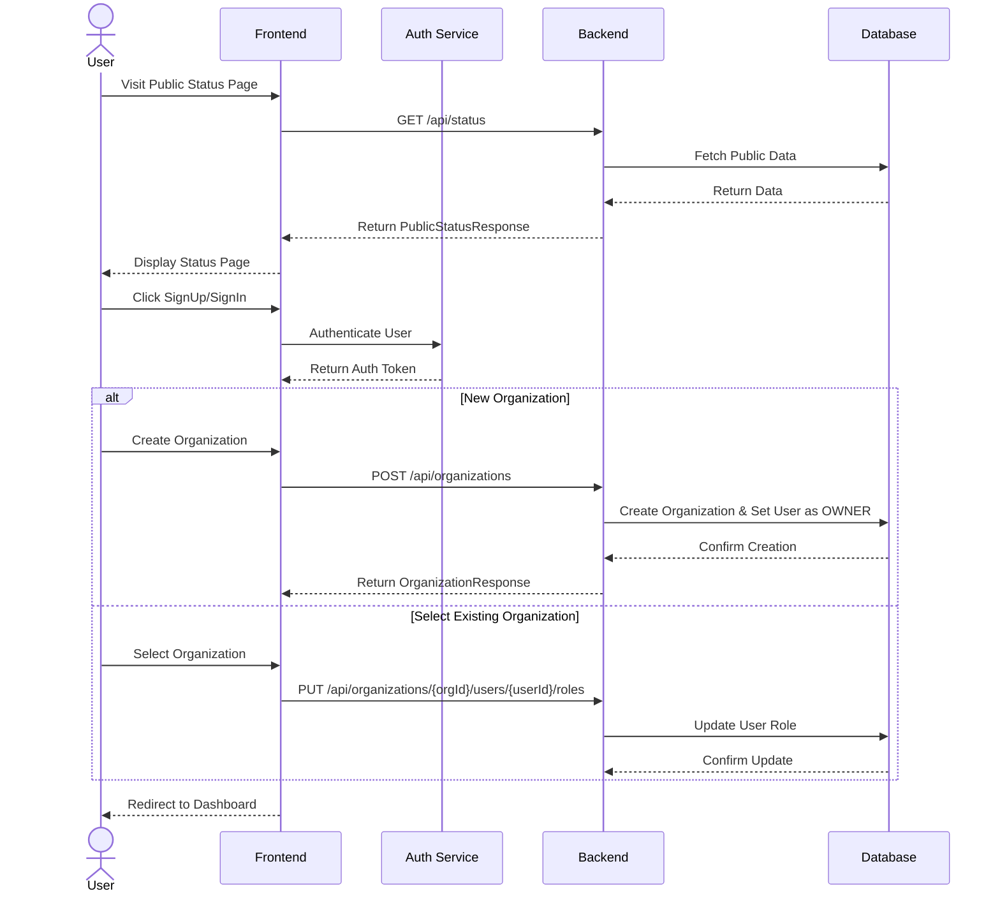
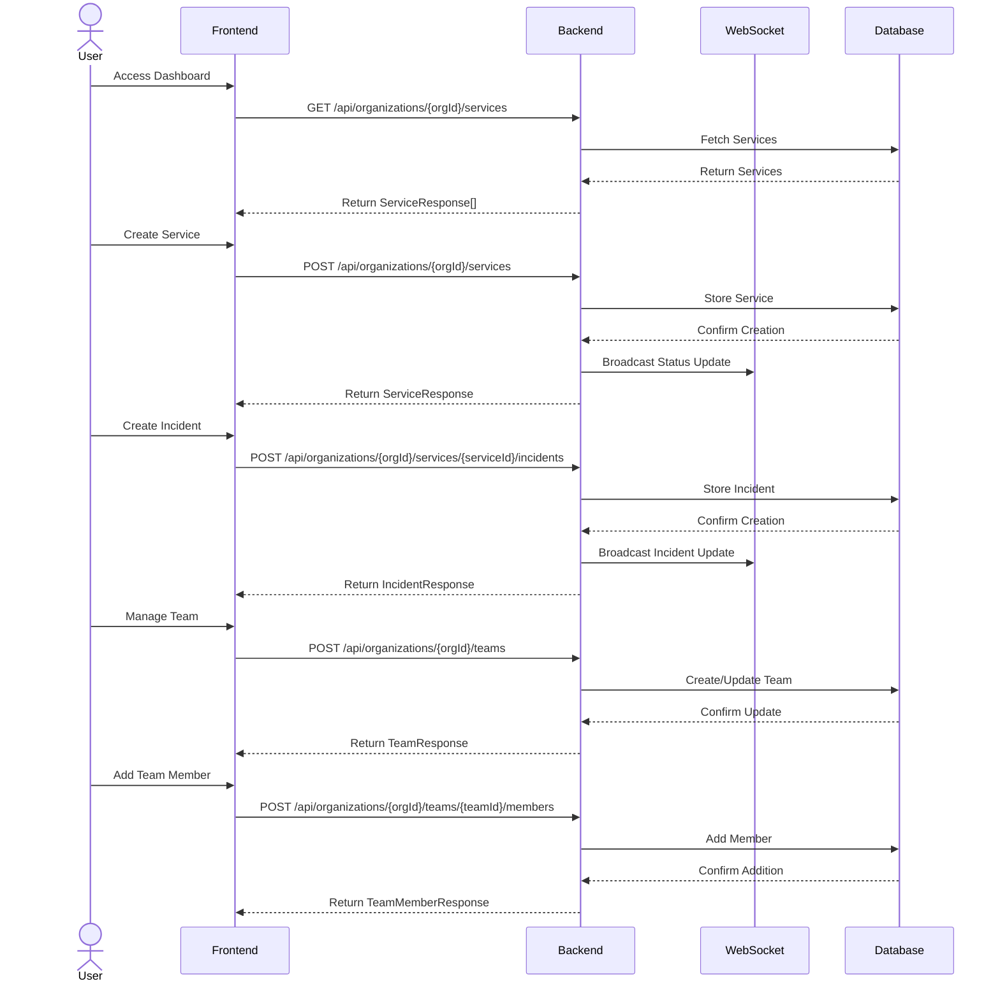
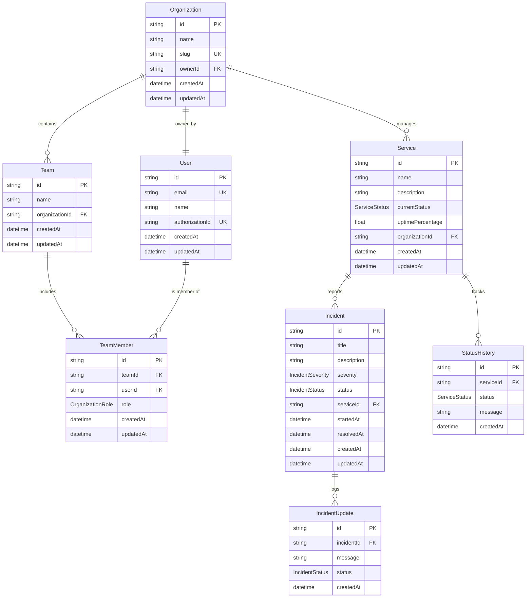

# pulse-watch-plivo-hiring-assignment

### Index

- [About](#about)
- [Setup Details](#setup)
- [Features](#features)
- [Implementation Status](#imp-status)
  - [Completed Implementation](#completed)
  - [**Pending Implementation**](#pending)
- [Tech Stack](#tech-stack)
- [Architecture Diagrams](#arch-diagrams)
  - [Authentication Flow](#auth-flow)
  - [Service and Incident Management Flow](#service-and-incident-flow)
  - [Database ER (entity-relationship) Diagram](#db-er)
- [APIs in Backend](#api-request-response)
- [URLs in UI](#urls)

## About <a id="about"></a>

Pulse Watch is a Status Page Application allowing users to maintain and manage services, incidents, schedule maintenance. Proving users with real-time updates and it includes both an administrative interface for managing services and a public-facing status page for end users

## Setup Details <a id="setup"></a>

- [Frontend](./frontend/README.md)
- [Backend](./backend/README.md)

- [Frontend Demo with Mock Data](https://sanaullahmohammed.github.io/pulse-watch-plivo-hiring-assignment/#/dashboard)

## Features <a id="features"></a>

- User Authentication and Team Management
- Multi-tenant Organization Support
- Service Status Management
- Incident and Maintenance Tracking
- Real-time Updates via WebSocket
- Public Status Page
- Modern UI with ShadcnUI

## Implementation Status <a id="completed"></a>

### Completed Components <a id="pending"></a>

1. Frontend Development
   The frontend implementation has successfully delivered the following features:

   - Public Status Page
     - Service listing functionality with active and past incidents across organizations
     - Organization-based filtering system
     - Authentication interface with Sign In and Sign Up capabilities
     - Dashboard access for authenticated users
   - Dashboard Features
     - Statistical overview displaying active incidents, services, and team member metrics
     - Recent services display implementation
     - Comprehensive service management interface
     - Incident management system with filtering capabilities
     - Team management functionality
   - Mock data integration for demonstration purposes

2. Backend Development
   The backend infrastructure has been established with:

   - Complete database schema design
   - PostgreSQL database implementation with defined relationships
   - Comprehensive API endpoints for:
     - Organizations
     - Services
     - Incidents
     - Teams
     - Team Members
     - Users
     - WebSocket connections for real-time updates

- Docker configuration for backend services

### Pending Implementation <a id="imp-status"></a>

1. Integration and Deployment

- Frontend and backend integration
- Authentication system implementation with Clerk
- Deployment configuration and execution
- GitHub Actions setup for automated deployments

2. Additional Features

- Email notification system
- Email invitation system for users
- Common error page implementation
- WebSocket connection between frontend and backend
- Team editing functionality

3. Code Quality and Architecture

- Clean Code Architecture principles implementation
- Error validation enhancements
- Frontend component optimization for reusability

4. Testing Implementation

- End-to-end testing using Playwright
- Unit testing coverage
- Integration testing

## Tech Stack <a id="tech-stack"></a>

- Frontend
  - `React 18`: Frontend framework
  - `TypeScript`: Static typing and enhanced developer experience
  - `Vite`: Build tool and development server
  - `TailwindCSS`: Utility-first CSS framework
  - `ShadcnUI`: Component library for consistent design
  - `React Router DOM`: Client-side routing
  - `React Hook Form`: Form handling and validation
  - `Lucide React`: Icon library
- Backend
  - `Express.js`: Node.js web application framework for building RESTful APIs
  - `Prisma`: Modern database ORM and toolkit for type-safe database operations
  - `TypeScript`: Programming language adding static types to JavaScript
  - `Node.js`: JavaScript runtime environment for server-side execution
  - `ESLint`: Code quality tool for identifying and fixing problems
  - `ts-node`: TypeScript execution engine and REPL for Node.js
  - `@prisma/client`: Auto-generated database client for type-safe queries
  - `Express Types`: TypeScript definitions for Express.js framework

## Architecture Diagrams <a id="arch-diagrams"></a>

### Authentication Flow <a id="auth-flow"></a>



### Service and Incident Management Flow <a id="service-incident-flow"></a>



### Database ER (entity-relationship) Diagram <a id="db-er"></a>



## API in Backend <a href="api-request-response"></a>

[https://github.com/sanaullahmohammed/pulse-watch-plivo-hiring-assignment/blob/main/backend/README.md](https://github.com/sanaullahmohammed/pulse-watch-plivo-hiring-assignment/blob/main/backend/README.md)

## URLs in UI <a id="urls"></a>

```

SignUp = "signup",

// Public routes
PublicStatus = "/",

// Root
Dashboard = "/dashboard",

// Team routes
AddTeamMembers = "/teams/add-members",
CreateTeam = "/teams/create",
ViewTeamMembers = "/teams/view-members",
EditTeamMeber = "/teams/edit-member/:teamId/:userId",

// Service routes
CreateService = "/services/create",
ServiceManagement = "/services/manage",
UpdateService = "/services/update/:serviceId",

// Incident routes
IncidentManagement = "/incidents/manage",
UpdateIncident = "/incidents/manage/:serviceId/:incidentId",
ReportServiceSpecificIncident = "/incidents/manage/:serviceId/new",
ReportIncident = "/incidents/report",

```
